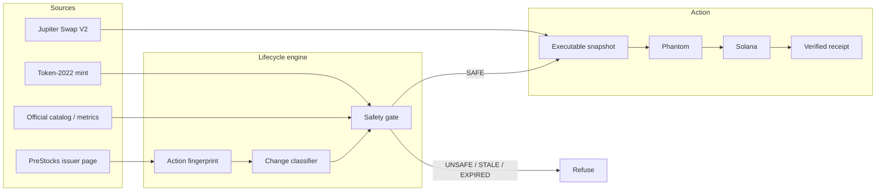
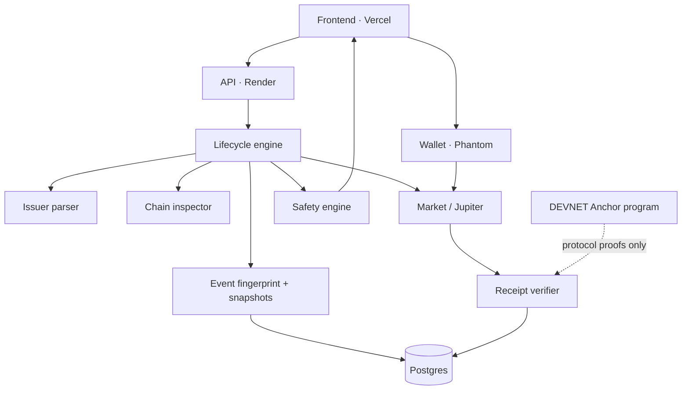

# T-MINUS

**When the issuer changes a PreStock, T-MINUS re-verifies issuer, chain, and market — then asks the holder to sign, or refuses.**

## What T-MINUS Is

A **PreStocks Asset Lifecycle & Action Engine**.

The Conversion Desk is the consumer. Jupiter Swap V2 is the execution path. Phantom is the signer. Solana is the proof.

It is not a DEX UI. It is not unattended Mainnet custody.

## The Problem

PreStocks tokens are not static.

The issuer can publish a going-public window, an acquisition ratio, a destination mint, and a deadline after which tokens are scheduled to expire worthless.

A swap interface will still quote the mint after that instruction moves. It will not tell the holder the action changed.

## The Insight

Holder risk appears at the lifecycle moment — not at the chart.

T-MINUS compares four truths before any signature:

| Layer | Question |
|---|---|
| Issuer | What did PreStocks publish, and did it change? |
| Chain | Is the mint paused, hooked, or fee-changed? |
| Market | Is there a live post-fee Jupiter route? |
| Execution | Is this the same action snapshot that built the transaction? |

## How It Works



## Lifecycle Model

States the implementation actually uses:

`TERMS_PENDING` → `CONVERSION_WINDOW` → `EXPIRED` (`CONVERTED` reserved)

| Asset | Issuer event | Stage | Holder result |
|---|---|---|---|
| SPACEX | `GOING_PUBLIC` until 12 Mar 2027 into `$SPCXx` or any token | `CONVERSION_WINDOW` | TRADE may be signed if gates pass |
| XAI | `ACQUISITION` into 0.7165 SPACEX by 12 Sep 2026 | `EXPIRED` | Signing halted. On-chain burn/freeze is not assumed |

Settlement is a **TRADE**, not a 1:1 rollover and not an automatic mint mutation.

## Event Change Detection

The issuer page is not a one-time fetch.

```
PREVIOUS ACTION
        ↓
SOURCE CHANGED
        ↓
RE-FETCH → RE-PARSE → CHAIN RECHECK → MARKET RECHECK → ROUTE RECHECK
        ↓
SIGNING GATE RE-EVALUATED
        ↓
NEW FINGERPRINT · NEW SNAPSHOT · OR A HALT
```

Fingerprint is SHA-256 over **actionable** fields only:

`sourceUrl | actionType | deadline | destination | ratio | allowsAny | expireWorthless | gonePublic | acquired`

Page chrome does not change the fingerprint. A deadline, destination, ratio, or event-type change does.

| Kind | Actionable halt? |
|---|---|
| `NO_CHANGE` | No |
| `TEXT_CHANGED_NON_ACTIONABLE` | No |
| `ACTION_CHANGED` | Yes |
| `DEADLINE_CHANGED` | Yes |
| `DESTINATION_CHANGED` | Yes |
| `RATIO_CHANGED` | Yes |
| `STATE_CHANGED` | Yes |
| `SOURCE_UNAVAILABLE` | Yes |
| `PARSE_CHANGED` | Yes |

Persisted in Postgres `issuer_event_snapshots`. Event History shows only real rows. Fake transitions are not invented.

## Safety Model

A transaction is bound to an **execution snapshot**:

`actionFingerprint + wallet + amount + destination + pause + hook + transferFeeBps`

Before execute:

1. Rebuild live issuer / chain / market / Jupiter.
2. Compare the bound snapshot to the live snapshot.
3. Fingerprint mismatch → `ACTION_CHANGED_REVERIFY_REQUIRED` — do not sign.
4. Other field mismatch or missing bound snapshot → `EXECUTION_SNAPSHOT_STALE` — do not sign.
5. Only then re-check expiry, floor, balance, pause, hook, route, quote freshness.

Signing is also refused when the window expired, the mint is unsupported, the route disappeared, the quote is stale, the wallet cannot fund the size, or the destination is unverified.

## Mainnet Execution

T-MINUS decides → Jupiter `GET /swap/v2/order` → Phantom `signTransaction` → Jupiter `POST /swap/v2/execute` → Solana confirms → T-MINUS stores a receipt **only after confirmation**.

Jupiter Trigger is not used. Trigger rejects transfer-fee mints. SPACEX is Token-2022 at **100 bps**.

## Real Mainnet Proof

Compact card from `evidence/mainnet-spacex-conversion.json`. Values were not typed by hand into this README.

| Field | Value |
|---|---|
| Action | SPACEX → SPCXx · `GOING_PUBLIC` |
| Amount | 1,827,211 raw SPACEX → 702,134 raw SPCXx |
| Display | 0.009136055 → 0.00702134 |
| Ratio | 0.768530837 |
| Route | Meteora DLMM · `order_execute` |
| Slot | 449215609 |
| Signature | `2RfXRieEW3HRZBVU4qHqnzRSvoV9KcEX5kYBzAjVW7VTkv2ig4u5frozAinumDnUApjWHLwcbsZEh3BSjsSWRNBW` |
| Explorer | [Solana Explorer](https://explorer.solana.com/tx/2RfXRieEW3HRZBVU4qHqnzRSvoV9KcEX5kYBzAjVW7VTkv2ig4u5frozAinumDnUApjWHLwcbsZEh3BSjsSWRNBW) |
| Status | Confirmed Mainnet TRADE. User-signed. Not a T-MINUS program fill. |

## DEVNET Protocol Proof

Anchor program `HRLmVcuk6PRcVwB3UVpcbEC3LVVMhdLZfPvHtmL2PUdL` is **DEVNET executable**.

Proven: `place` · `cancel` · `fill` · partial fill · `expire` · failsafe tick · double-fill protection.

**DEVNET protocol proof ≠ Mainnet PreStocks conversion.**

The Mainnet T-MINUS program is **not deployed**. Proven minimum safe Mainnet deploy balance: **1.08473244 SOL**. Not required for the Conversion Desk.

| Proof | Explorer |
|---|---|
| Program | [DEVNET program](https://explorer.solana.com/address/HRLmVcuk6PRcVwB3UVpcbEC3LVVMhdLZfPvHtmL2PUdL?cluster=devnet) |
| Place | [tx](https://explorer.solana.com/tx/4bQGKezkzwM7576eAnDtkDDPzQPff9qCB6nz8a4hDdVwCTfDqZqFQnLL8JeEzTQz8RrHcc6iirb88ygtM5M2eTPK?cluster=devnet) |
| Cancel | [tx](https://explorer.solana.com/tx/27RpwuFScXheLTScUEckuB8vgZKF7KCRSGC4E22BgWP1KRnfUirXJD5rJsGUCGq2ay3a8JbtKW9inVWnQFWyMTf6?cluster=devnet) |
| Fill | [tx](https://explorer.solana.com/tx/26YLJiQh51AeQH2XNXqGgruM3L5KthHNNk83z1iSsNL4WiLnDYbmPD4ffaZX997sibXvc8doRZZKDJSARcc9mv7x?cluster=devnet) |
| Expire | [tx](https://explorer.solana.com/tx/3H6f11sD5F3vzVgTD287CW4xcUWePNjkwCRiLdDJDEB251cyuD56Y2GPyzjLCWcTPePGVaJD8u7D8ZSJUBTRY8Zm?cluster=devnet) |
| Failsafe tick | [tx](https://explorer.solana.com/tx/5cZurXQRKMZGWoLhpyamUjGQ9dZn61UgckDf7osoVwk34U6kVMNJ6XuAGiSH7GDoiWaTa2BKV9EXjFHHvVKAuwXw?cluster=devnet) |

Fixture mints on DEVNET are **not** SPACEX.

## Public API

Base: `https://tminus-api-k2d2.onrender.com`

| Endpoint | Purpose |
|---|---|
| `GET /v1/actions` | Lifecycle list: issuer + chain + market + fingerprint |
| `GET /v1/actions/:asset` | One action |
| `GET /v1/actions/:asset/evidence` | Source URL, hash, fingerprint, event change |
| `GET /v1/actions/:asset/events` | Persisted issuer transitions only |
| `GET /v1/actions/:asset/executable` | Bound execution snapshot + optional Jupiter tx |
| `GET /v1/actions/:asset/status` | Stage, refusals, fingerprint |
| `GET /v1/actions/:asset/position` | Holder SPACEX / SOL |
| `GET /v1/actions/:asset/chain` | Mint inspection |
| `GET /v1/actions/:asset/market` | Token / mark / holders |
| `GET /v1/actions/:asset/route` | Quote without assembling a tx |
| `POST /v1/conversions/execute` | Submit a user-signed Swap V2 tx; snapshot must still match |

Useful to the PreStocks ecosystem because trading, wallets, and analytics already exist. This surface is the **lifecycle state machine**.

## Why It Belongs to PreStocks

[prestocks.com/ecosystem](https://prestocks.com/ecosystem) already lists trading, wallets, and analytics.

T-MINUS addresses the issuer-event moment:

- **SPACEX** — going public, window open, executable TRADE, real Mainnet receipt.
- **XAI** — acquired, window closed, signing refused.

Same engine. Opposite outcomes. That is the product.

## Security / Trust Model

- T-MINUS never holds Mainnet PreStocks.
- The holder signs in Phantom.
- Receipts are written only after Solana confirmation.
- Issuer-retained mint / freeze / pause / permanent-delegate powers are inspected; pause and attached transfer hooks refuse signing.
- Stale quotes (>15s at assemble, 60s at execute re-check) cannot sign.
- Design simulation is `NEXT_PUBLIC_TMINUS_SOURCE=design` only and is not production.

## Architecture



## Evidence

- `evidence/mainnet-spacex-conversion.json` — Mainnet TRADE
- `evidence/event-change-research.json` — live PreStocks + Jupiter research freeze
- `evidence/devnet-e2e.json` and related DEVNET receipts — protocol proofs
- `evidence/mainnet-deployment-cost.json` — Mainnet program deploy cost, not spent

## Production

| Surface | URL |
|---|---|
| App | https://tminusapp.vercel.app |
| API | https://tminus-api-k2d2.onrender.com |
| GitHub | https://github.com/mohamedwael201193/T-MINUS |

Frontend talks to Render. Production source is live API, not design fixtures.

## Current Limitations

- Mainnet T-MINUS program is **not deployed**. Unattended escrow cannot run on Mainnet.
- Conversion is a market TRADE. Liquidity, slippage, and Jupiter availability are real constraints.
- XAI’s published deadline has passed. Leftover XAI is not claimed burned or frozen.
- Public RPC and Jupiter may 429. Stale quotes cannot be signed.
- Issuer still holds mint / freeze / pause / delegate powers on SPACEX.
- Event History has no fabricated past. If PreStocks has not changed the instruction since T-MINUS started recording, the panel will say so.

## Future

1. Follow every official issuer page as new corporate events publish.
2. Paid RPC so mint inspection does not depend on public rate limits.
3. Mainnet program deploy only after explicit human approval and funded rent.
4. External consumers of `/v1/actions` inside the PreStocks ecosystem.
5. Persist richer transition history as real issuer changes occur — never simulated in production.

## Setup

```
pnpm install
pnpm test
pnpm --filter @tminus/api typecheck
pnpm secret-scan
```

Frontend: `cd frontend && npx next dev -p 3001`

Copy `.env.example` to `.env`. Never commit `.env` or keypair JSON.

Program tests: WSL (`scripts/wsl-anchor-test.sh`). Anchor is not native Windows.
