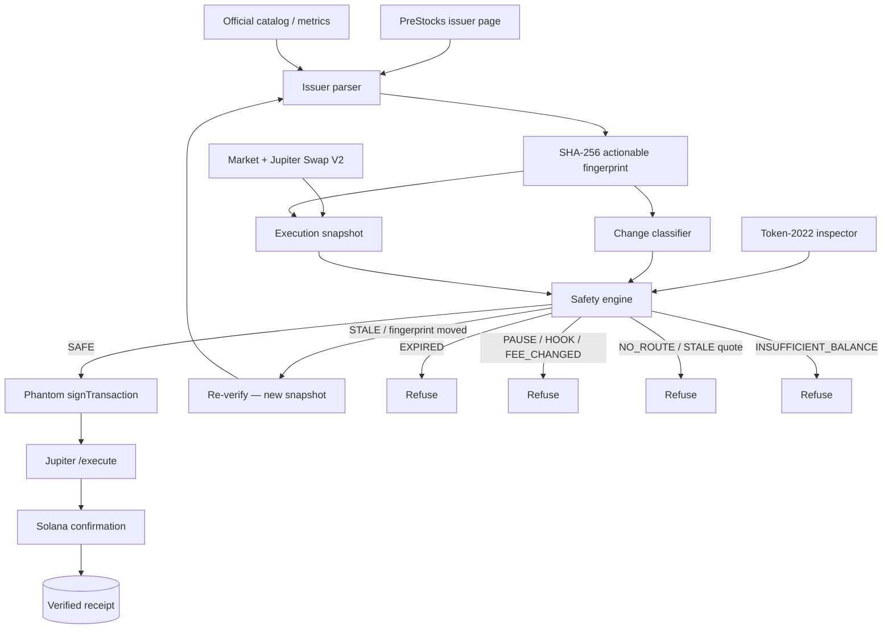
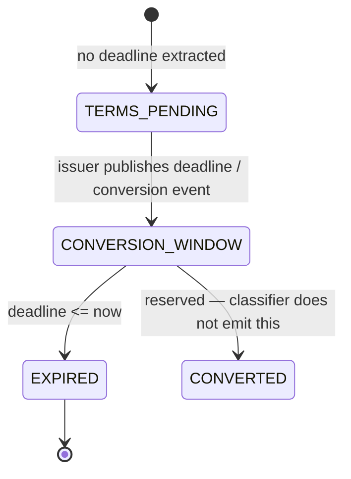
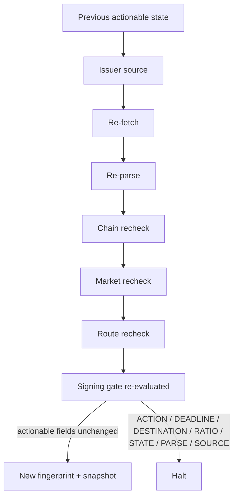
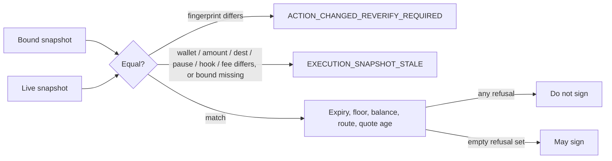
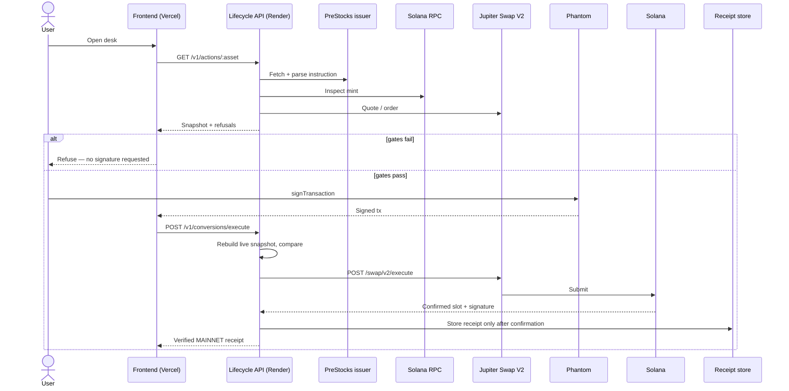
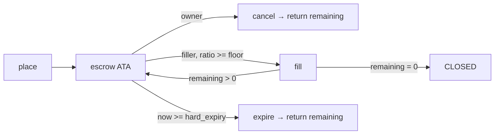
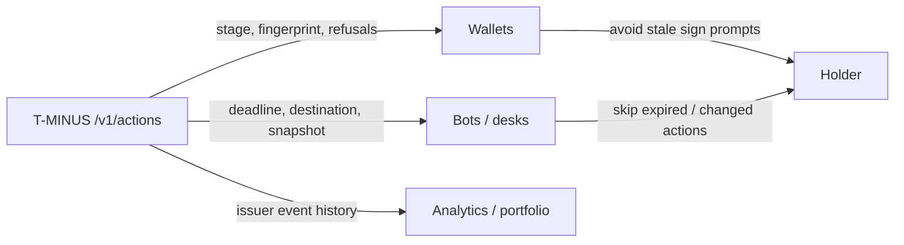
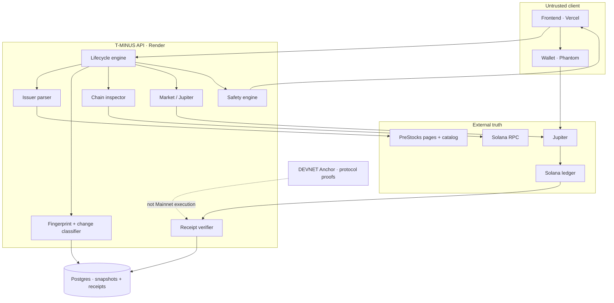

# T-MINUS

**When the issuer changes a PreStock, T-MINUS re-verifies before the holder signs.**

[](https://prestocks.com)
[](https://explorer.solana.com/tx/2RfXRieEW3HRZBVU4qHqnzRSvoV9KcEX5kYBzAjVW7VTkv2ig4u5frozAinumDnUApjWHLwcbsZEh3BSjsSWRNBW)
[](#event-change-detection)
[](#mainnet-execution)
[](#token-2022-safety)

Live app: [tminusapp.vercel.app](https://tminusapp.vercel.app) · API: [tminus-api-k2d2.onrender.com](https://tminus-api-k2d2.onrender.com) · Explorer: [SPACEX → SPCXx](https://explorer.solana.com/tx/2RfXRieEW3HRZBVU4qHqnzRSvoV9KcEX5kYBzAjVW7VTkv2ig4u5frozAinumDnUApjWHLwcbsZEh3BSjsSWRNBW)

---

## What T-MINUS Is

T-MINUS is a **PreStocks Asset Lifecycle & Action Engine**.

It reads an issuer instruction, inspects the Token-2022 mint, prices a live Jupiter route, and then either asks the holder to sign — or refuses. The Conversion Desk is the consumer of that decision. The engine is the product.

A PreStock is not a static ticker. The issuer can open a going-public window, name a destination mint, publish an acquisition ratio, and set a deadline after which leftover tokens are scheduled to expire worthless. T-MINUS treats that instruction as a first-class state object: parsed, fingerprinted, snapshotted, and bound to any transaction the holder is asked to sign.

It is not a DEX UI. It is not unattended Mainnet custody. It does not hold the holder’s PreStocks. Settlement on Mainnet is a **user-authorized Jupiter TRADE**, confirmed on Solana, then stored as a receipt.

---

## The Problem

PreStocks live through corporate events.

| Event class | What can change |
|---|---|
| Going public | deadline, destination mint, “any token” allowance |
| Acquisition / merger | destination, stated ratio, expiry |
| Window close | stage flips to `EXPIRED`; leftover tokens are not assumed burned |

A generic swap interface can still quote the mint after the instruction moves. It prices inventory. It does not know that yesterday’s destination, deadline, or ratio is no longer the issuer’s instruction.

Holder risk appears at that lifecycle boundary — not merely at price discovery.

---

## The Core Insight

Four independent truths must agree before a signature is requested.

| Layer | Question | If it fails |
|---|---|---|
| **Issuer** | What did PreStocks publish, and did the actionable fields change? | Halt. Re-verify or refuse. |
| **Chain** | Is the mint paused, hooked, fee-changed, or on an unsupported program? | Refuse. |
| **Market** | Is there a live post-fee Jupiter route inside the holder’s floor? | Refuse. |
| **Execution** | Is this still the snapshot that built the transaction? | `ACTION_CHANGED_REVERIFY_REQUIRED` or `EXECUTION_SNAPSHOT_STALE`. |

Same engine. Opposite outcomes:

- **SPACEX** — `GOING_PUBLIC`, window open, executable TRADE, real Mainnet receipt.
- **XAI** — `ACQUISITION`, deadline passed, signing refused.

---

## Product Flow



---

## Why This Is PreStocks-Native

T-MINUS is not a generic Solana app with a PreStocks logo. The domain objects are issuer events and PreStock mints.

**SPACEX** (`PreANxuXjsy2pvisWWMNB6YaJNzr7681wJJr2rHsfTh`) is Token-2022 at **100 bps**. The issuer page states a going-public conversion into `$SPCXx` or any token before **11:59pm UTC 12 March 2027**. T-MINUS classifies that as `GOING_PUBLIC` / `CONVERSION_WINDOW` / settlement `TRADE`.

**XAI** (`PreC1KtJ1sBPPqaeeqL6Qb15GTLCYVvyYEwxhdfTwfx`) was acquired into **0.7165 SPACEX** by **12 September 2026**. T-MINUS classifies that as `ACQUISITION` / `EXPIRED`. The destination is still recorded. Signing is not offered. On-chain burn or freeze is not assumed.

[prestocks.com/ecosystem](https://prestocks.com/ecosystem) already lists trading, wallets, analytics, bots, leverage, indexes, and related integrations. T-MINUS occupies the remaining layer: **issuer-event lifecycle state and holder-safe action**.

Current public ecosystem listings emphasize trading, wallets, analytics, bots, leverage, indexes, and related integrations; T-MINUS focuses on issuer-event lifecycle state and holder-safe action.

---

## The Lifecycle Engine

Entities that exist in code:

| Entity | Role |
|---|---|
| **PreStock / CatalogAsset** | Mint, symbol, official-catalog flag, parsed deadline, destination |
| **Lifecycle stage** | `TERMS_PENDING` · `CONVERSION_WINDOW` · `EXPIRED` (`CONVERTED` reserved, not assigned by the classifier) |
| **Corporate action** | Issuer instruction + on-chain mint + market + Jupiter + T-MINUS gate |
| **Issuer instruction** | `GOING_PUBLIC` / `ACQUISITION` / `EXPIRY` / `NONE`, deadline, destination, ratio, flags |
| **Action evidence** | Source URL, source hash, fetch time, fingerprint |
| **On-chain state** | pause, transfer hook, transfer-fee bps, token program, authorities |
| **Market state** | token price, mark, holders |
| **Execution snapshot** | Bound fingerprint + wallet + amount + destination + pause + hook + fee |
| **Safety gate** | Deterministic refusals; `allowed` only when the set is empty |
| **Receipt** | Written only after Solana confirmation. MAINNET conversion vs DEVNET protocol |

Settlement is a **TRADE**, not a 1:1 rollover and not an automatic mint mutation.

---

## State Machine

`CONVERTED` is reserved in the type. The classifier does not assign it. Conversion on Mainnet is a TRADE, not an on-chain mint mutation that would mark the source `CONVERTED`.



---

## Event Change Detection

The issuer page is not a one-time fetch. Every listing rebuilds the instruction, hashes the **actionable** fields, and compares against the last persisted row in Postgres `issuer_event_snapshots`.



Fingerprint is SHA-256 over:

```
sourceUrl | actionType | deadline | destination | ratio | allowsAny | expireWorthless | gonePublic | acquired
```

Page chrome does not change the fingerprint. A cosmetic extra sentence is `TEXT_CHANGED_NON_ACTIONABLE`. A deadline, destination, ratio, or event-type change is actionable.

| Kind | Actionable halt? |
|---|---|
| `NO_CHANGE` | No |
| `TEXT_CHANGED_NON_ACTIONABLE` | No |
| `ACTION_CHANGED` | Yes |
| `DEADLINE_CHANGED` | Yes |
| `DESTINATION_CHANGED` | Yes |
| `RATIO_CHANGED` | Yes |
| `STATE_CHANGED` | Yes |
| `SOURCE_UNAVAILABLE` | Yes |
| `PARSE_CHANGED` | Yes |

Event History shows only real persisted transitions. Fake history is not invented. If PreStocks has not changed the instruction since recording started, the panel says so.

What is invalidated on an actionable change: the previous fingerprint, the bound execution snapshot, and any Jupiter transaction assembled under that snapshot. Signing stays halted until a new fetch produces a matching live snapshot and the rest of the gates pass.

---

## Execution Snapshot

A signable transaction is bound to:

```
actionFingerprint
+ wallet (taker)
+ amountRaw
+ destinationMint
+ paused
+ hookProgramId
+ transferFeeBps
```

`quoteFetchedAt` is stored as evidence. Execute equality **ignores** it so a legitimate re-quote does not self-stale. Freshness is enforced separately (15s at assemble, 60s at execute).



`OLD SNAPSHOT ≠ LIVE SNAPSHOT` → no signature.

---

## Safety Engine

Signing is a deterministic function of `evaluateSafety`. The gate does not “try anyway.”

| Refusal | Meaning |
|---|---|
| `EXPIRED` | Window closed or stage `CONVERTED` |
| `TERMS_PENDING` | No conversion window yet |
| `EVIDENCE_MISSING` | Issuer evidence absent / source unavailable |
| `DESTINATION_UNVERIFIED` | Destination mint not resolved |
| `RPC_UNAVAILABLE` | Chain inspect failed |
| `PAUSED` | Mint pause extension is on |
| `HOOK_PRESENT` | Attached transfer hook |
| `MINT_UNSUPPORTED` | Unknown token program, or fee present but unmodeled |
| `FEE_CHANGED` | Observed bps ≠ baseline |
| `NO_ROUTE` / `JUPITER_REJECTED` | No live Swap V2 route |
| `STALE` | Quote older than the allowed window |
| `BELOW_FLOOR` | Post-fee ratio under the holder floor |
| `USER_WALLET_REQUIRED` / `WALLET_MISMATCH` | No taker, or tx taker ≠ requested taker |
| `AMOUNT_INVALID` / `INSUFFICIENT_BALANCE` / `INSUFFICIENT_SOL` | Size cannot be funded |
| `ACTION_CHANGED_REVERIFY_REQUIRED` | Fingerprint moved |
| `EXECUTION_SNAPSHOT_STALE` | Bound snapshot missing or fields moved |

Jupiter **Trigger** is not used. Trigger rejects transfer-fee mints. SPACEX is Token-2022 at 100 bps. Conversion uses Swap V2 `GET /swap/v2/order` + user `signTransaction` + `POST /swap/v2/execute`.

---

## Mainnet Execution



Custody: T-MINUS never holds Mainnet PreStocks. The holder authorizes the trade. Jupiter executes it. Solana is the proof.

The production Conversion Desk uses user-authorized Jupiter execution on Mainnet. The T-MINUS Anchor protocol remains a separate Devnet proof of trust-minimized escrow mechanics.

---

## Real Mainnet Proof

User-signed Mainnet TRADE. Not a T-MINUS program fill. Not an automatic rollover. Values from [`evidence/mainnet-spacex-conversion.json`](evidence/mainnet-spacex-conversion.json).

| | |
|---|---|
| **Action** | SPACEX → SPCXx · `GOING_PUBLIC` |
| **Amount** | 1,827,211 raw SPACEX → 702,134 raw SPCXx |
| **Display** | 0.009136055 → 0.00702134 |
| **Ratio** | 0.768530837 |
| **Route** | Meteora DLMM · `order_execute` |
| **Slot** | 449215609 |
| **Signature** | `2RfXRieEW3HRZBVU4qHqnzRSvoV9KcEX5kYBzAjVW7VTkv2ig4u5frozAinumDnUApjWHLwcbsZEh3BSjsSWRNBW` |
| **Explorer** | **[Open on Solana Explorer](https://explorer.solana.com/tx/2RfXRieEW3HRZBVU4qHqnzRSvoV9KcEX5kYBzAjVW7VTkv2ig4u5frozAinumDnUApjWHLwcbsZEh3BSjsSWRNBW)** |
| **Taker** | `CpTxsgPjvaaPSaBKkijvB1h3hzgJmPiTsWNhuS7tRkgX` |
| **Status** | Confirmed Mainnet TRADE. Receipt stored after confirmation. |

1 display SPACEX = `200_000_000` raw. SPCXx uses 8 decimals.

---

## SPACEX Case Study

Positive path — window open, gates can pass when the wallet can fund size.

```
Issuer GOING_PUBLIC
        ↓
Deadline 12 Mar 2027 23:59 UTC
        ↓
Destination SPCXx (allows any token; desk default is the named mint)
        ↓
Token-2022 · 100 bps · not paused · no transfer hook
        ↓
Live Jupiter route (post-fee)
        ↓
Safety gate
        ↓
Phantom signTransaction
        ↓
Jupiter /execute
        ↓
Solana slot 449215609
        ↓
Verified MAINNET receipt
```

After the proof trade the connected wallet holds **0 SPACEX**. Sign conversion is refused (`INSUFFICIENT_BALANCE`). No signature is requested at zero balance.

---

## XAI Case Study

Negative path — same engine, opposite outcome.

```
Issuer ACQUISITION into 0.7165 SPACEX
        ↓
Deadline 12 Sep 2026 23:59 UTC — passed
        ↓
Stage EXPIRED
        ↓
Destination still recorded (SPACEX)
        ↓
SIGNING REFUSED
```

The desk still shows issuer destination, statement, and chain fee. It does not describe a placeable escrow order. Leftover XAI is not claimed burned or frozen.

That is the product: a route finder would still quote. T-MINUS will not ask for a signature.

---

## Mainnet vs Devnet Architecture

| | Mainnet Conversion Desk | Devnet Anchor protocol |
|---|---|---|
| Assets | Real PreStocks (SPACEX, XAI, …) | Fixture mints — **not** SPACEX |
| Data | Live issuer + chain + market | Local/devnet accounts |
| Execution | User-signed Jupiter Swap V2 | `place` / `cancel` / `fill` / `expire` escrow |
| Proof | Verified MAINNET receipt | Protocol receipts labeled DEVNET |
| Program | Not the execution path | `HRLmVcuk6PRcVwB3UVpcbEC3LVVMhdLZfPvHtmL2PUdL` executable |

DEVNET protocol proof ≠ Mainnet PreStocks conversion.

---

## Protocol Engineering

Anchor program on Devnet. Instructions: `place`, `cancel`, `fill`, `expire`.

| Mechanic | Behavior |
|---|---|
| Token-2022 escrow | `transfer_checked`; store **post-fee received** raw |
| Floor | `min_ratio_e9` until `failsafe_ts`, then `failsafe_floor_e9` |
| Partial fills | `min_fill_raw`; last remainder may close the order |
| Under-delivery | Rejected (`dst_raw >= ceil_ratio(fill, floor)`) |
| Hard expiry | After `hard_expiry_ts`, `fill` refuses; anyone may `expire` remaining escrow to owner |
| Double-fill | Status `CLOSED` after remaining hits zero; further fill fails `StatusClosed` |
| Pause / hook | Mint inspect rejects paused mints and attached transfer-hook programs |
| Permissionless fill | Filler is not the owner; no admin withdrawal of user escrow |



Lib tests (`cargo test -p tminus --lib`) cover `ceil_ratio` rounding and mint pause/hook TLV inspection. Full instruction e2e (`place` / `cancel` / `fill` / `expire` / failsafe / double-fill) is proven on Devnet localnet via `scripts/wsl-anchor-test.sh`.

| Proof | Explorer |
|---|---|
| Program | [DEVNET program](https://explorer.solana.com/address/HRLmVcuk6PRcVwB3UVpcbEC3LVVMhdLZfPvHtmL2PUdL?cluster=devnet) |
| Place | [tx](https://explorer.solana.com/tx/4bQGKezkzwM7576eAnDtkDDPzQPff9qCB6nz8a4hDdVwCTfDqZqFQnLL8JeEzTQz8RrHcc6iirb88ygtM5M2eTPK?cluster=devnet) |
| Cancel | [tx](https://explorer.solana.com/tx/27RpwuFScXheLTScUEckuB8vgZKF7KCRSGC4E22BgWP1KRnfUirXJD5rJsGUCGq2ay3a8JbtKW9inVWnQFWyMTf6?cluster=devnet) |
| Fill | [tx](https://explorer.solana.com/tx/26YLJiQh51AeQH2XNXqGgruM3L5KthHNNk83z1iSsNL4WiLnDYbmPD4ffaZX997sibXvc8doRZZKDJSARcc9mv7x?cluster=devnet) |
| Expire | [tx](https://explorer.solana.com/tx/3H6f11sD5F3vzVgTD287CW4xcUWePNjkwCRiLdDJDEB251cyuD56Y2GPyzjLCWcTPePGVaJD8u7D8ZSJUBTRY8Zm?cluster=devnet) |
| Failsafe tick | [tx](https://explorer.solana.com/tx/5cZurXQRKMZGWoLhpyamUjGQ9dZn61UgckDf7osoVwk34U6kVMNJ6XuAGiSH7GDoiWaTa2BKV9EXjFHHvVKAuwXw?cluster=devnet) |

---

## Token-2022 Safety

SPACEX is Token-2022. Transfer fee, pause, and hook are signing inputs, not decorations.

| Inspect | Effect on signing |
|---|---|
| Transfer fee (100 bps on SPACEX) | Priced into the route; Trigger APIs reject this mint |
| Pause | `PAUSED` — refuse |
| Transfer hook program | `HOOK_PRESENT` — refuse |
| Fee bps ≠ baseline | `FEE_CHANGED` — refuse |
| Destination mint | Must resolve and verify; otherwise `DESTINATION_UNVERIFIED` |
| Issuer mint / freeze / pause / permanent-delegate | Displayed as issuer-retained powers; pause still refuses |

Raw-unit accounting is mandatory. UI display uses the pinned multiplier (`200_000_000` raw = 1 SPACEX).

---

## Public API

**T-MINUS public API** — not an official PreStocks API.

Base: `https://tminus-api-k2d2.onrender.com`

### Lifecycle

| Endpoint | Purpose |
|---|---|
| `GET /v1/actions` | Issuer + chain + market + fingerprint list |
| `GET /v1/actions/:asset` | One corporate action |
| `GET /v1/actions/:asset/status` | Stage, refusals, fingerprint |

### Evidence / events

| Endpoint | Purpose |
|---|---|
| `GET /v1/actions/:asset/evidence` | Source URL, hash, fingerprint, event change |
| `GET /v1/actions/:asset/events` | Persisted issuer transitions only |

### Execution

| Endpoint | Purpose |
|---|---|
| `GET /v1/actions/:asset/executable` | Bound snapshot + optional Jupiter tx |
| `GET /v1/actions/:asset/route` | Quote without assembling a tx |
| `POST /v1/conversions/execute` | Submit a user-signed Swap V2 tx; snapshot must still match |

### Position / chain / market

| Endpoint | Purpose |
|---|---|
| `GET /v1/actions/:asset/position?owner=` | Holder SPACEX / SOL |
| `GET /v1/actions/:asset/chain` | Mint inspection |
| `GET /v1/actions/:asset/market` | Token / mark / holders |
| `GET /v1/activity?owner=` | Wallet-filtered Mainnet conversions and matching Devnet protocol rows |

Support: `GET /health`, `GET /v1/receipts`, `GET /v1/program`, `GET /v1/pda`, `GET /v1/prestocks`, `GET /v1/balances`.

`GET /v1/receipts` is the public proof ledger. `GET /v1/activity?owner=` is the same receipt table, filtered to one wallet. Mainnet conversions are user-signed Jupiter trades. Devnet rows are protocol proofs. The API does not invent escrow PDAs for Mainnet trades.

Trading, wallets, and analytics already exist. This surface is the **lifecycle state machine**.

---

## Ecosystem Integration



Other apps can consume lifecycle state, learn that an issuer event moved, and avoid presenting a stale swap as if it were still the corporate action.

This is not a PreStocks endorsement. It is a machine-readable layer those products do not currently expose.

---

## Architecture



Trust boundary: the API decides eligibility. The wallet signs. The ledger confirms. Postgres stores what Solana already finalized.

---

## Data Flow

Mainnet conversion — who talks to whom, and what is trusted.

```mermaid
sequenceDiagram
  actor Holder
  participant Desk as Conversion Desk
  participant Engine as Lifecycle API
  participant Issuer as PreStocks issuer + catalog
  participant Chain as Solana RPC
  participant Book as Jupiter Swap V2
  participant Wallet as Phantom
  participant Ledger as Solana
  participant Store as Postgres

  Holder->>Desk: Select PreStock + size
  Desk->>Engine: GET /v1/actions/:asset/executable
  Engine->>Issuer: Fetch page + catalog
  Engine->>Engine: Parse instruction, SHA-256 fingerprint
  Engine->>Store: Compare previous issuer snapshot
  Engine->>Chain: Token-2022 inspect
  Engine->>Book: GET /swap/v2/order
  Engine->>Engine: evaluateSafety + bind execution snapshot
  alt refusal set non-empty
    Engine-->>Desk: allowed=false
    Desk-->>Holder: No signature requested
  else allowed
    Engine-->>Desk: snapshot + unsigned tx
    Holder->>Wallet: signTransaction
    Wallet-->>Desk: signed tx
    Desk->>Engine: POST /v1/conversions/execute
    Engine->>Engine: Rebuild live snapshot; refuse if stale/changed
    Engine->>Book: POST /swap/v2/execute
    Book->>Ledger: Submit
    Ledger-->>Engine: Confirmed signature + slot
    Engine->>Store: Receipt after confirmation
    Engine-->>Desk: Verified MAINNET receipt
  end
```

---

## Evidence

| Artifact | What it proves |
|---|---|
| [`evidence/mainnet-spacex-conversion.json`](evidence/mainnet-spacex-conversion.json) | User-signed Mainnet SPACEX → SPCXx TRADE |
| [`evidence/event-change-research.json`](evidence/event-change-research.json) | Live PreStocks + Jupiter research freeze |
| [`evidence/lifecycle-action-engine.json`](evidence/lifecycle-action-engine.json) | Engine / desk architecture freeze |
| [`evidence/devnet-e2e.json`](evidence/devnet-e2e.json) | Devnet place / fill path |
| [`evidence/devnet-failsafe-tick.json`](evidence/devnet-failsafe-tick.json) | Failsafe floor tick |
| [`evidence/devnet-double-fill.json`](evidence/devnet-double-fill.json) | Double-fill protection |
| [`evidence/mainnet-deployment-cost.json`](evidence/mainnet-deployment-cost.json) | Measured Mainnet program rent — not spent |

---

## Testing

Verified locally on the current tree:

| Suite | Count | What it proves |
|---|---|---|
| `@tminus/sdk` | 6 | Ratio ceil, display raw (`200_000_000`), PDA stability |
| `@tminus/api` | 83 | Issuer parse, fingerprint, change kinds, snapshot mismatch, safety refusals, catalog, cluster labels, HTTP contract, wallet-filtered activity |
| `@tminus/keeper` | 14 | Floor / failsafe, pause+hook halt, fee-change halt, spend cap, pair filter |
| Frontend unit | 10 | MAINNET conversion vs DEVNET protocol mapping; verifiedOnchain; wallet dust is the default amount, not `0.01` |
| `cargo test -p tminus --lib` | 10 | `ceil_ratio`; pause/hook mint TLV |
| Typecheck | api + keeper + sdk + frontend `tsc` | No ignored TS errors (`ignoreBuildErrors: false`) |
| `next build` | frontend | Production bundle |
| `pnpm secret-scan` | workspace | No committed secrets |

Issuer-change simulation (deadline A → B invalidates the old snapshot) is **test-mode only**. Production never injects fake issuer history.

Anchor instruction e2e is localnet (`scripts/wsl-anchor-test.sh`). GitHub Actions runs the lib tests, not a public-RPC validator.

---

## CI / Release Engineering

GitHub Actions (`.github/workflows/ci.yml`):

| Job | Runs |
|---|---|
| **node** | `pnpm test` · `pnpm typecheck` · `pnpm secret-scan` · mock-import guard |
| **frontend** | `tsc --noEmit` · `next build` (same path Vercel uses) |
| **rust** | `cargo test -p tminus --lib` |

Node CI does **not** call public Solana RPC. `SOLANA_RPC_URL` / `DEVNET_RPC_URL` point at a closed local port; cluster labels still assert. `DATABASE_URL` points at a closed local port so GitHub does not need production Postgres. Snapshot reads (`latestFeed`, issuer-event history) return empty on connection failure — listing still builds from the live PreStocks catalog. Catalog fetches abort at 8s. Mint inspect and program-status RPC abort at 5s and do not retry 429s. Jobs have a 15-minute timeout so a hung socket cannot occupy the runner for hours.

---

## Production

| Surface | URL |
|---|---|
| App | https://tminusapp.vercel.app |
| API | https://tminus-api-k2d2.onrender.com |
| GitHub | https://github.com/mohamedwael201193/T-MINUS |

Frontend talks to Render. Production source is the live API (`BackendSource`). Design simulation is `NEXT_PUBLIC_TMINUS_SOURCE=design` only and is not production.

---

## Security Model

- No server custody of Mainnet PreStocks.
- The holder signs in Phantom.
- Execute rebuilds issuer / chain / market / Jupiter and compares the bound snapshot before submit.
- Receipts are written only after Solana confirmation.
- Pause and attached transfer hooks refuse signing.
- Stale quotes cannot sign.
- Secrets stay in `.env` / host env. Never in git. `pnpm secret-scan` is CI-gated.
- Production does not serve design fixtures or simulated issuer transitions.

---

## Why It Belongs on Solana

Token-2022 is the PreStocks mint standard. Transfer fees, pause, and hooks are on-chain facts T-MINUS inspects rather than infers. Phantom provides the signature. Jupiter composes the TRADE. Solana confirmation is the receipt’s source of truth. None of those properties exist off-chain as a substitute.

---

## Hackathon Fit

**Best Use of PreStocks** is a corporate-action / infrastructure wedge: issuer-event lifecycle, not another swap screen.

Evidence, not slogans:

- PreStocks-native domain (SPACEX window vs XAI expiry on the same engine).
- Real issuer parsing + actionable fingerprints + snapshot invalidation.
- Real Phantom signature, real Jupiter Swap V2, real Mainnet explorer proof.
- Public `/v1/actions` for wallets, desks, and analytics that already exist in the ecosystem.

---

## Demo

| | |
|---|---|
| Live app | https://tminusapp.vercel.app |
| GitHub | https://github.com/mohamedwael201193/T-MINUS |
| API | https://tminus-api-k2d2.onrender.com/v1/actions |
| Mainnet explorer | [2RfXRieE…SWRNBW](https://explorer.solana.com/tx/2RfXRieEW3HRZBVU4qHqnzRSvoV9KcEX5kYBzAjVW7VTkv2ig4u5frozAinumDnUApjWHLwcbsZEh3BSjsSWRNBW) |

Path:

1. Landing — issuer-event hero, SPACEX live vs XAI expired, Mainnet proof card.
2. Console **SPACEX** — window open, destination SPCXx, Sign disabled at 0 balance. **My activity** lists this wallet’s verified Mainnet trades (not escrow orders).
3. Console **XAI** — `EXPIRED`, destination SPACEX, Sign not requested.
4. Ledger — Mainnet conversions first, then DEVNET protocol proofs.

---

## Technical Setup

```
pnpm install
pnpm test
pnpm typecheck
pnpm secret-scan
```

Frontend: `cd frontend && npm install && npx next dev -p 3001`

Copy `.env.example` to `.env`. Never commit `.env` or keypair JSON.

Program lib tests: `cargo test -p tminus --lib`

Program e2e: WSL (`scripts/wsl-anchor-test.sh`). Anchor is not native Windows.

---

## Operational Notes

- Conversion is a market TRADE. Liquidity, slippage, and Jupiter availability are real constraints.
- Public RPC and Jupiter may 429; stale quotes cannot be signed.
- Issuer-retained mint / freeze / pause / delegate authorities remain on SPACEX.
- Event History is empty until a real issuer change is recorded.
- Render free tier can cold-start. Vercel production deploys are CLI `--prod`.
- `/ready` checks RPC + Postgres; `/health` does not.
- Console **My activity** is wallet-filtered receipts (`GET /v1/activity?owner=`). The ledger is the unfiltered proof log. Mainnet conversions are Jupiter trades, not T-MINUS escrow orders.

---

## Performance / Reliability

No synthetic benchmarks. Observed behavior:

- Issuer + catalog fetches abort at 8s.
- Jupiter order/execute calls abort at 12s / 30s.
- Quote must be ≤15s at assemble, ≤60s at execute.
- Program-status RPC inspects abort at 5s and do not retry 429s.
- Lifecycle feed freshness window: 5 minutes (`FEED_STALE_MS`).
